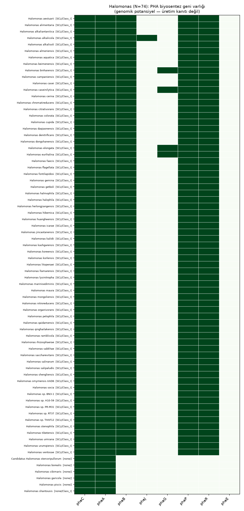
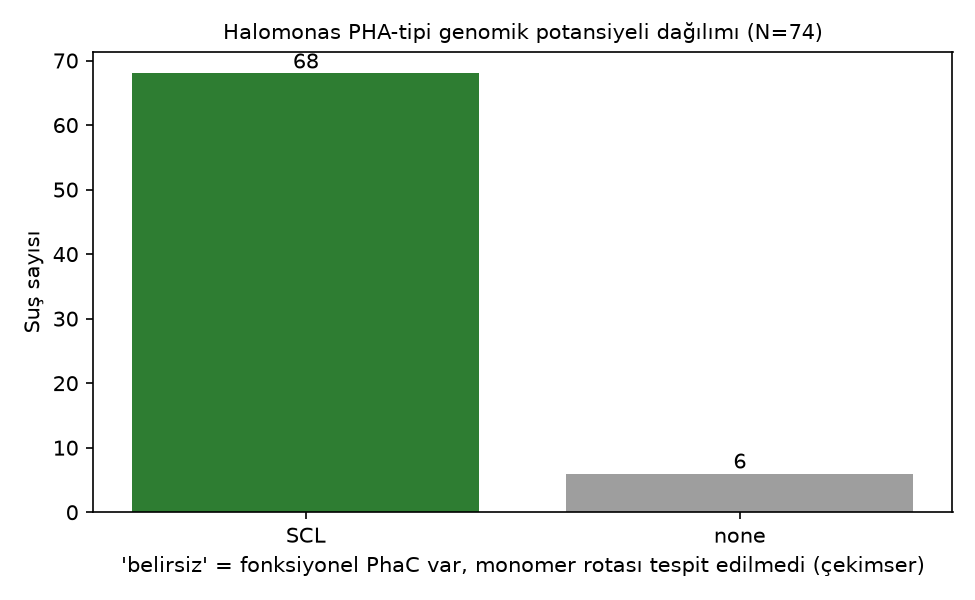

# Application: PHA genomic-potential screen of 74 *Halomonas* genomes

A real-data demonstration of PHAscout: an unlabeled, genus-wide set of **74
*Halomonas* genomes** (NCBI assemblies, species-level diversity) screened for the
**genomic potential** to synthesize PHA. This is a **characterization/mapping**
exercise, not a discovery and not an accuracy benchmark.

> ⚠️ **Framing (do not overstate).** Output is *genomic potential*, not production.
> Gene presence does not prove PHA accumulation — that needs experimental validation
> (GC-MS/NMR/FTIR/Nile-red/gravimetric/TEM). *Halomonas* is a **well-known PHA-producer
> genus** (e.g. *H. bluephagenesis* is an industrial PHB/PHBV chassis), so a high
> "potential" rate here is **expected**, not novel. Most strains are unlabeled, so **no
> accuracy/precision is claimed.**

## How it was run

```bash
python scripts/screen_halomonas.py        # 74 accessions -> analysis/halomonas/results.csv
python scripts/summarize_halomonas.py     # figures + sorted table
```

Each genome goes through the full pipeline (HMM scan → BLOSUM specificity filter →
PhaC class + catalytic-triad/lipase-box functional validation → operon/synteny →
unified PHA-type potential). 74/74 completed, 0 failures.

## Results





| PHA-type potential | strains | % |
|---|---|---|
| **SCL** (Class I, P(3HB)) | 68 | 92% |
| **none** (no functional PhaC) | 6 | 8% |
| MCL / belirsiz / SCL-co-MCL | 0 | 0% |

- **Functional Class I PhaC in 68/74 (92%)**, all with the canonical PHB operon
  (`phaC–phaA–phaB`, plus phasin `phaP` + regulator `phaR` in 68/74). This is the
  expected SCL/PHB signature for the genus.
- **No Class II/III**: `phaE` absent in all 74 (no archaeal-type PhaEC), MCL synthases
  absent — consistent with *Halomonas* biology. So the honest answer to "which PHA type"
  is: this genus is **overwhelmingly SCL**; there is essentially no PHA-type diversity to
  map here. (Said plainly so the figure isn't oversold.)
- **Accessory-gene variation** (the genuinely interesting axis):
  - `phaG` (de-novo fatty-acid route gene) in 4 strains — *H. binhaiensis, caseinilytica,
    elongata, eurihalina*. Note the synthase is still SCL-class, so the tool reports SCL,
    not MCL: phaG presence alone does not make a Class I organism an MCL producer.
  - `phaJ` (β-oxidation (R)-hydratase) in 1 strain — *H. alkalicola*.

### The 6 "none" — where functional validation earns its keep

All six carry a **phaC-like HMM hit + a thiolase hit** (`phaC|phaA`) but the PhaC
**fails functional validation** (no intact catalytic triad + lipase box; 5 of 6 don't
even classify into a synthase class) and they **lack `phaB`/`phaP`/`phaR`**:

| strain | phaC class | functional | genes |
|---|---|---|---|
| *Candidatus* H. stercoripullorum | — | ✗ | phaC\|phaA |
| H. borealis | — | ✗ | phaC\|phaA |
| H. cibimaris | — | ✗ | phaC\|phaA |
| H. garicola | — | ✗ | phaC\|phaA |
| H. piscis | — | ✗ | phaC\|phaA |
| H. shantousis | Class_I | ✗ (conf 1.8) | phaC\|phaA |

A **presence-based BLAST/HMM screen would miscall these as PHA producers** (a phaC hit is
there!). PHAscout's catalytic-triad validation withholds the call instead. Whether these
are pseudogenes / divergent synthases / generic α/β-hydrolases mislabeled as phaC, or
genuine PHA-negatives, **requires experimental follow-up** — but the point stands: the
tool does not hand out false positives on the strength of a homology hit alone.

### Honesty correction on real data (*H. alkalicola*)

An earlier version of this project (`Table3_Novel_Discoveries_Report.pdf`, since removed)
claimed *H. alkalicola* as a **"SCL-co-MCL novel producer."** The corrected pipeline
reports it as **SCL**. Reason: its `phaJ` feeds (R)-3-hydroxyacyl-CoA from β-oxidation,
but the synthase is **Class I (SCL-specific)** — a 3HHx-containing SCL-*co*-MCL co-polymer
requires an MCL-capable / broad-substrate synthase, which is absent. Same genome, honest
call. This is exactly the systematic over-claim the unified `pha_type` layer was built to
prevent.

## Limitations

- Genomic potential only; **not** evidence of production. Most strains unlabeled → no
  accuracy claim. (Drop any wet-lab-supported strains into `wetlab_known.csv`; they are
  marked ★ as *supporting examples*, not as a validation set.)
- *Halomonas* is PHA-rich, so the 92% rate is expected — this demonstrates **throughput +
  honest functional filtering**, not a finding.
- PhaC confidence saturates at 100 for canonical Class I (bit scores ≫ cap), so the score
  is not discriminative within this genus.
- The 6 negatives are not experimentally confirmed; "none" here means "no validated
  functional synthase," not "proven non-producer."

## Files

- `results.csv` / `results_sorted.csv` — per-strain table (class, functional, potential, genes).
- `gene_heatmap.png`, `potential_distribution.png` — figures.
- `wetlab_known.csv` — optional overlay of strains with literature PHA data (you fill it).
- `cache/` — raw per-genome JSON reports (git-ignored).
